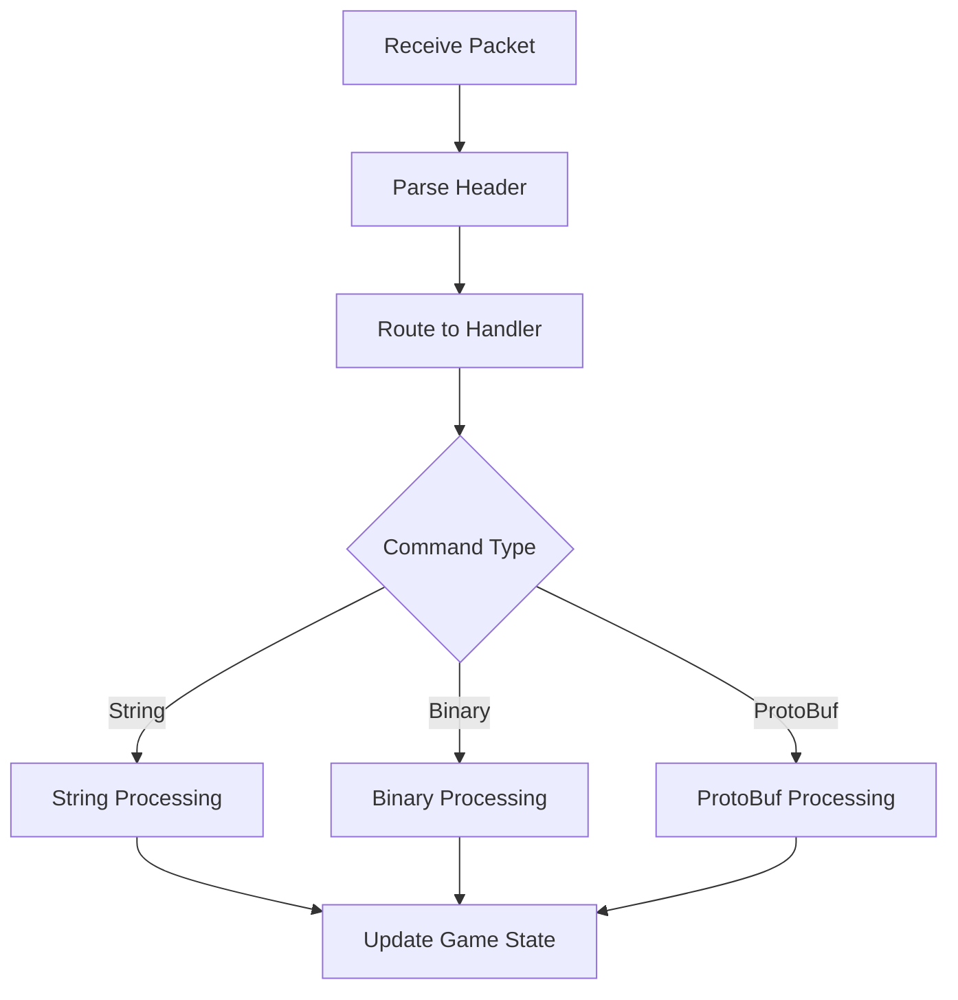

# UNITY MOBILE MMORPG CLIENT - CODEBASE DOCUMENTATION

## TABLE OF CONTENTS
- [Cấu trúc tổng quan](#cấu-trúc-tổng-quan)
- [Core Systems](#core-systems)
- [Network System](#network-system)
- [Asset Management](#asset-management)
- [UI System](#ui-system)
- [Game Logic Systems](#game-logic-systems)
- [Configuration Files](#configuration-files)
- [Development Guides](#development-guides)

---

## CẤU TRÚC TỔNG QUAN

### **#project-structure #architecture #overview**
cl/
├── Assets/
│ ├── Scripts/
│ │ └── HSGameEngine/ # Core game engine
│ │ ├── MainGame.cs # Game entry point
│ │ ├── GameEngine/ # Core engine systems
│ │ └── GameFramework/ # Game framework
│ ├── Resources/ # Runtime resources
│ ├── StreamingAssets/ # Platform assets
│ ├── Plugins/ # Native plugins
│ └── Editor/ # Editor tools
├── Android_TIYAN/ # Android build configs
├── Android_TM/ # Android platform specific
└── iOS/ # iOS platform specific

### **Game Instance & Entry Points**
**#game-instance #entry-points #initialization**

**MainGame.cs:** Singleton game manager
```csharp
// Entry point chính của game
public class MainGame : MonoBehaviour
{
    public static MainGame _current;  // Singleton instance
    
    // Game initialization flow:
    // 1. Platform initialization
    // 2. Network setup
    // 3. Asset loading
    // 4. Scene management
}
```

**GameInstance.cs:** Global game state
```csharp
// Quản lý state toàn cục
public static class GameInstance
{
    public static TCPGame Game;      // Network manager
    public static GData Data;        // Game data
}
```

---

## CORE SYSTEMS

### **Network Communication Architecture**
**#network-architecture #tcp-communication #command-processing**

#### **TCP Client Management**
**File:** `Assets/Scripts/HSGameEngine/GameEngine/Network/TCPClient.cs`

```csharp
public class TCPClient
{
    // Socket connection management
    private Socket _Socket;
    private bool _Connected;
    
    // Packet processing
    public bool SendData(TCPOutPacket tcpOutPacket)
    public bool ProcessServerCmd(int cmdID, byte[] data, int count)
}
```

**Chức năng chính:**
- Quản lý TCP socket connection
- Send/receive data packets
- Connection state monitoring
- Auto-reconnection handling

#### **Command Processing System**
**File:** `Assets/Scripts/HSGameEngine/GameEngine/Network/TCPCmdHandler.cs`

```csharp
public enum TCPGameServerCmds
{
    CMD_LOGIN_ON = 100,           // Login command
    CMD_ROLE_LIST,                // Character list
    CMD_SPR_MOVE,                 // Movement
    CMD_SPR_ATTACK,               // Combat
    // 800+ commands total
}

public class TCPCmdHandler
{
    public static bool ProcessServerCmd(TCPClient client, int nID, byte[] data, int count)
    {
        // Command routing based on ID
        switch (nID)
        {
            case (int)TCPGameServerCmds.CMD_LOGIN_ON:
                return ProcessUserInfoCmd(client, nID, data, count);
            // ... handle other commands
        }
    }
}
```

**Command Categories:**
1. **Authentication:** Login, logout, session management
2. **Character:** Movement, attributes, equipment
3. **Combat:** Attack, skills, damage
4. **Social:** Chat, friends, guilds
5. **Economy:** Trading, shops, inventory

#### **Data Serialization System**
**#serialization #data-formats #protobuf**

**Multiple serialization methods:**

1. **String-based (Simple commands):**
```csharp
// Format: "field1:field2:field3"
string cmd = string.Format("{0}:{1}:{2}", userID, token, serverID);
```

2. **ProtoBuf (Complex data):**
```csharp
[ProtoContract]
public class RoleData
{
    [ProtoMember(1)]
    public int RoleID = 0;
    
    [ProtoMember(2)]
    public string RoleName = "";
}
```

3. **Custom Binary (Performance critical):**
```csharp
public byte[] toBytes()
{
    // Custom binary serialization for optimal performance
}
```

### **Session Management**
**#session-management #authentication #user-data**

**File:** `Assets/Scripts/HSGameEngine/GameEngine/Network/Session.cs`

```csharp
public class Session
{
    // User authentication
    public string UserID = "";
    public string UserName = "";
    public string UserToken = "";
    
    // Character data
    public RoleData roleData = null;
    public int RoleID = -1;
    
    // Game state
    public bool PlayGame = false;
}
```

**Session Lifecycle:**
1. **Platform Login:** Platform SDK authentication
2. **Server Login:** Game server authentication
3. **Character Selection:** Choose/create character
4. **Game Session:** Active gameplay
5. **Logout:** Clean session termination

---

## NETWORK SYSTEM

### **Connection Management**
**#connection-management #tcp-game #network-states**

**File:** `Assets/Scripts/HSGameEngine/GameEngine/Network/TCPGame.cs`

```csharp
public class TCPGame
{
    public enum GameStates 
    { 
        CLIENT_READY = 0, 
        CLIENT_CONNECTING, 
        CLIENT_CONNECTED, 
        CLIENT_LOGON 
    }
    
    // Connection flow:
    // 1. CLIENT_READY -> CLIENT_CONNECTING (Connect())
    // 2. CLIENT_CONNECTING -> CLIENT_CONNECTED (Socket connected)
    // 3. CLIENT_CONNECTED -> CLIENT_LOGON (Authentication success)
}
```

### **Protocol Implementation**
**#protocol-implementation #packet-structure #command-routing**

#### **Packet Structure:**
[Header: 4 bytes - Command ID]
[Header: 4 bytes - Data Length]
[Body: Variable - Serialized Data]

#### **Command Processing Flow:**


### **Ping & Heartbeat System**
**#ping-management #heartbeat #connection-monitoring**

**File:** `Assets/Scripts/HSGameEngine/GameEngine/Network/TCPPing.cs`

```csharp
public class TCPPing
{
    // Track ping for different command types
    private static long MoveCmdStartTicks = 0;
    private static long HeartCmdStartTicks = 0;
    
    public static void RecordSendCmd(int nID)
    public static void RecordRecCmd(int nID)
    public static long GetPingTicks()
}
```

**Heartbeat Commands:**
- `CMD_SPR_CLIENTHEART`: Client heartbeat (every 2 seconds)
- `CMD_SPR_CHECK`: Anti-speed-hack check
- `CMD_SPR_POSITION`: Position synchronization

---

## ASSET MANAGEMENT

### **AssetBundle System**
**#asset-bundles #dynamic-loading #mobile-optimization**

**Structure:**
AssetBundles/
├── Android/ # Platform-specific bundles
├── StreamingAssets/ # Built-in assets
└── Resources/ # Runtime resources


**Loading Strategies:**
1. **Static Loading:** Essential game assets
2. **Dynamic Loading:** On-demand content
3. **Streaming:** Large assets (maps, audio)

### **Resource Management**
**#resource-management #memory-optimization #asset-lifecycle**

**Key Principles:**
- Lazy loading for non-essential assets
- Aggressive unloading on mobile
- Platform-specific optimizations
- Memory pool management

---

## UI SYSTEM

### **NGUI Integration**
**#ngui #ui-architecture #mobile-ui**

**UI Structure:**
UI/
├── Controls/ # Reusable UI components
├── Windows/ # Game windows/dialogs
├── HUD/ # Heads-up display
└── Effects/ # UI effects/animations

**Key Components:**
- **UIRoot:** Main UI canvas
- **UICamera:** UI event handling
- **UIPanel:** UI organization
- **Custom Controls:** Game-specific UI elements

### **Platform UI Adaptations**
**#platform-ui #responsive-design #mobile-adaptations**

**Mobile Considerations:**
- Touch input handling
- Screen size adaptations
- Performance optimizations
- Battery efficiency

---

## GAME LOGIC SYSTEMS

### **Character System**
**#character-system #roledata #attributes**

**File:** `Assets/IGSoft_Resources/Plugins/Scripts/Server/Data/RoleData.cs`

```csharp
[ProtoContract]
public class RoleData
{
    // Basic info
    [ProtoMember(1)] public int RoleID = 0;
    [ProtoMember(2)] public string RoleName = "";
    [ProtoMember(3)] public int RoleSex = 0;
    [ProtoMember(4)] public int Occupation = 0;
    [ProtoMember(5)] public int Level = 1;
    
    // Resources
    [ProtoMember(7)] public int Money1 = 0;      // Bound currency
    [ProtoMember(8)] public int Money2 = 0;      // Unbound currency
    [ProtoMember(9)] public long Experience = 0;
    
    // Equipment & inventory systems
    // Skill & progression systems
    // Social systems integration
}
```

### **Cross-Server System**
**#cross-server #kuafu #server-switching**

**File:** `Assets/Scripts/HSGameEngine/GameFramework/Controls/KuaFuLoginManager.cs`

```csharp
public class KuaFuLoginManager
{
    // Cross-server login data
    public static KuaFuServerLoginData KuaFuServerLoginData = null;
    
    // Server switching functionality
    public static bool ChangeToKuaFuServer(KuaFuServerLoginData data)
    public static void ChangeToOriginalServer()
    
    // Cross-server authentication
    public static string GetKuaFuLoginString(string normal)
}
```

**Cross-Server Features:**
- Server switching without logout
- Cross-server events and competitions
- Shared user authentication
- Load balancing support

---

## PLATFORM INTEGRATION

### **Mobile Platform SDKs**
**#platform-sdk #android-ios #native-integration**

#### **Android Integration**
**File:** `Assets/Scripts/HSGameEngine/JavaPlugins/AndroidSDKPlugin.cs`

```csharp
public class AndroidSDKPlugin
{
    #if UNITY_ANDROID
    private static AndroidJavaObject UnityPlayerActivity;
    private static AndroidJavaClass TMUtils;
    #endif
    
    public static void SDKInit()
    public static void Login()
    public static void Pay(int money, string orderId)
}
```

#### **iOS Integration**
**File:** `Assets/Scripts/HSGameEngine/JavaPlugins/IOSSDKPlugin.cs`

```csharp
public class IOSSDKPlugin
{
    #if UNITY_IPHONE
    [DllImport("__Internal")]
    private static extern void _NativeFunction();
    #endif
    
    public static void SDKInit()
    public static void Login()
    public static void Pay(int money, string orderId)
}
```

### **Platform Abstraction**
**#platform-abstraction #unified-api #cross-platform**

**File:** `Assets/Scripts/HSGameEngine/JavaPlugins/PlatSDKMgr.cs`

```csharp
public class PlatSDKMgr
{
    // Unified platform interface
    public static void Login(EventHandler callback)
    public static void Pay(int money, string productId)
    public static void ShowUserCenter()
    
    // Platform detection
    public static string PlatName { get; set; }
    public static int Platform { get; }
}
```

---

## CONFIGURATION MANAGEMENT

### **Config File System**
**#configuration #xml-config #game-settings**

**Config Types:**
1. **Platform Config:** `Resources/platconfig.xml`
2. **Server Config:** Server lists và connection info
3. **Game Config:** Gameplay parameters
4. **Asset Config:** Resource management settings

**Example Platform Config:**
```xml
<root>
    <platID>0</platID>
    <platName>TM</platName>
    <version>1.0.1</version>
    <buildTime>2024-01-01</buildTime>
</root>
```

### **Data Management**
**#data-management #persistence #configuration**

**Storage Methods:**
- **PlayerPrefs:** Simple key-value storage
- **XML Files:** Complex configurations
- **Binary Files:** Performance-critical data
- **Remote Config:** Server-driven settings

---

## DEVELOPMENT GUIDES

### **Adding New Features**

#### **1. Adding New Characters**
**#new-character #character-creation #roledata-extension**

**Steps:**
1. **Extend RoleData:** Add new character attributes
```csharp
[ProtoMember(100)] public int NewAttribute = 0;
```

2. **Update Character Creation:** Modify character creation UI
3. **Add Validation:** Implement server-side validation
4. **Update Serialization:** Ensure proper data handling

#### **2. Adding New Maps**
**#new-map #map-creation #scene-management**

**Files to modify:**
- `Assets/StreamingAssets/Map/` - Add map data
- `Assets/StreamingAssets/MapConfig/` - Add map configuration
- Scene management code - Add map loading logic

**Steps:**
1. Create map assets
2. Add map configuration
3. Update scene loading system
4. Add teleport points
5. Configure monster spawns

#### **3. Adding New Skills**
**#new-skill #skill-system #combat-mechanics**

**Implementation areas:**
- Skill data structures
- Animation systems
- Effect systems
- Combat calculations
- Network synchronization

#### **4. Adding New Monsters**
**#new-monster #monster-creation #ai-system**

**Files to modify:**
- `Assets/StreamingAssets/Monster/` - Monster data
- AI behavior scripts
- Combat system integration
- Loot table configuration

#### **5. Adding New Bosses**
**#new-boss #boss-mechanics #special-ai**

**Special considerations:**
- Advanced AI patterns
- Phase-based combat
- Special effects
- Raid mechanics
- Reward systems

### **Configuration Modification Guides**

#### **Map Configuration Changes**
**#map-config #map-modification #configuration-changes**

**To modify map {mapName} configuration:**

1. **Map Data Files:**
   - `Assets/StreamingAssets/MapConfig/{mapName}.xml`
   - `Assets/StreamingAssets/Map/{mapName}/`

2. **Code Files:**
   - Scene loading logic in GameEngine
   - Map-specific event handlers
   - Teleport system updates

3. **Asset Files:**
   - Terrain assets
   - Texture assets
   - Audio assets
   - Effect assets

#### **Server Configuration**
**#server-config #connection-settings #server-management**

**Configuration Files:**
- Platform configuration for server selection
- Network timeout settings
- Reconnection parameters
- Load balancing configuration

### **Debugging & Troubleshooting**

#### **Network Issues**
**#debugging #network-debugging #troubleshooting**

**Common Issues:**
1. **Connection Timeouts:** Check network settings
2. **Command Processing Failures:** Verify command IDs
3. **Serialization Errors:** Check data integrity
4. **Performance Issues:** Monitor ping và bandwidth

**Debug Tools:**
- Network packet logging
- Command execution tracking
- Performance profiling
- Memory monitoring

#### **Platform Issues**
**#platform-debugging #mobile-issues #sdk-problems**

**Common Platform Issues:**
1. **SDK Integration:** Native plugin problems
2. **Permission Issues:** Platform-specific permissions
3. **Performance:** Mobile optimization problems
4. **Compatibility:** Device-specific issues

### **Performance Optimization**

#### **Network Optimization**
**#performance #network-optimization #mobile-performance**

**Strategies:**
- Command batching
- Data compression
- Intelligent caching
- Connection pooling

#### **Memory Optimization**
**#memory-optimization #asset-management #garbage-collection**

**Best Practices:**
- Asset lifecycle management
- Memory pool usage
- Garbage collection optimization
- Platform-specific optimizations

#### **CPU Optimization**
**#cpu-optimization #performance-tuning #mobile-cpu**

**Techniques:**
- Algorithm optimization
- Update frequency management
- Multithreading where appropriate
- Platform-specific optimizations

---

## FAQ & COMMON TASKS

### **Frequently Asked Questions**

**Q: Phần code nào xử lý việc đăng nhập?**
A: Authentication được xử lý trong `TCPGame.cs` và `Session.cs`, với platform-specific code trong `PlatSDKMgr.cs`

**Q: Tôi muốn thay đổi config của map cụ thể thì phải sửa những file nào?**
A: Sửa file XML trong `StreamingAssets/MapConfig/`, asset files trong `StreamingAssets/Map/`, và scene loading logic trong GameEngine

**Q: Để thêm character mới thì cần làm gì?**
A: Extend `RoleData` class, update character creation UI, modify validation logic, và ensure serialization compatibility

**Q: Làm sao để debug network issues?**
A: Sử dụng network logging trong `TCPClient`, monitor ping trong `TCPPing`, và check command processing trong `TCPCmdHandler`

**Q: Performance optimization nên bắt đầu từ đâu?**
A: Bắt đầu với Unity Profiler để identify bottlenecks, sau đó focus vào network optimization, memory management, và asset optimization

---

## **🔗 RELATED DOCUMENTATION**

- **Learning Roadmap:** Development progression guide
- **Knowledge Base:** Technical concepts và best practices
- **API Reference:** Detailed class và method documentation
- **Platform Guides:** Platform-specific development information

